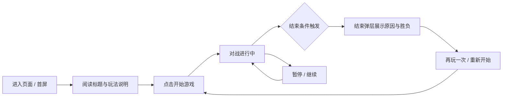
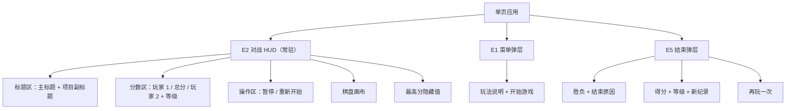
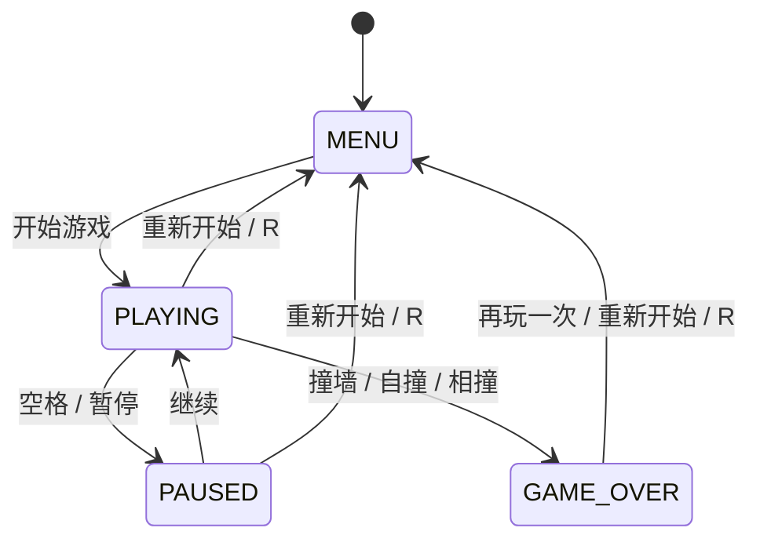

# 产品设计：Web 端多用户同屏贪吃蛇大战 · DeepSeek-V4.1-Flash

## 1. 制品元数据

- artifact_type: product_design
- activity_id: 8b752f09-fd68-4281-ab2e-82542191826e
- activity_key: product_design.work.1
- stage: product_design
- stage_run_id: cacd2a39-d59d-4519-8329-2ce0c88f1bc8
- workflow_id: b5c7ccc5-94b9-41c9-9b0c-fa4557749d4c
- input_manifest_sha256: 4e2252cd9fd88141cf4f4647e280e3c6410c2601ffcaf17e6379fd9e740aebbc
- request_intent_sha256: 0ea2cdbc4ccb2657be1180fcf59b4f7c1f2e5083968c983d559e549e3d395772
- requirement_baseline_sha256: 1c5e90d9db9cf9b4c131068e618ce96c276fe9ae772d24956448379c77268526
- upstream_git_commit_sha: 3a7f3c024cf71b309a23c62ca63c7f3a7a3d088a
- generation: 1
- primary_repo: https://github.com/sideline8318/snake-loop
- project_name: snake-loop-competition
- product_display_title: Web版多用户同屏贪吃蛇大战 · DeepSeek-V4.1-Flash

本制品以需求基线 `requirement_baseline`（sha256=1c5e90d9db9cf9b4c131068e618ce96c276fe9ae772d24956448379c77268526）为唯一上游输入，承接其冻结范围（IN-01~IN-10 / OUT-01~OUT-05 / AS-01~AS-03）与需求条目（REQ-*），将需求转化为可实施的玩法设计、交互设计、信息架构与状态机，并给出需求到验收标准（AC-001~AC-005）的完整映射。

## 2. 产品定位与设计目标

### 2.1 一句话定位

一款零后端依赖、打开即玩的同屏双人对战贪吃蛇 Web 游戏：两名玩家在同一块棋盘上实时竞速，方向键 / WASD 与屏幕按钮双通道控制，吃到能量点得分，撞墙、自撞或相撞即结束本局并可立即重开。

### 2.2 设计目标

- G-01 首屏 3 秒内可进入游戏：无登录、无加载等待、无网络请求依赖（对齐 IN-01、AS-03）。
- G-02 双人对战规则一眼可懂：通过标题、图例、玩家配色与开场说明，让两名玩家在无说明书情况下完成一局（对齐 IN-02、REQ-ARENA-01）。
- G-03 输入零歧义：键盘与屏幕按钮两套控制等价可用，且输入不导致反向自杀（对齐 IN-03、IN-04、REQ-INPUT-01~04）。
- G-04 反馈即时可感知：吃食物加分、结束原因、胜负结论均在同一屏内可见（对齐 IN-05、IN-06）。
- G-05 用户可读标题强呈现：页面 `<title>`、`<h1>` 与项目副标题均展示用户可读标题（对齐 IN-08、REQ-TITLE-01/02）。

### 2.3 设计原则

- P-01 单屏即完整战场：棋盘、双方分数、总分、控制盘与状态弹层在同一视图内，不跨页跳转。
- P-02 对称公平：两名玩家共享同一棋盘、同一食物、同一速度曲线，仅初始位置与朝向镜像。
- P-03 渐进清晰：以菜单 → 对战 → 结束弹层三段式覆盖新玩家与老玩家两条路径。
- P-04 容错优先：任何时刻均可暂停与重开，误操作不造成不可恢复状态。

## 3. 目标用户与场景

| 用户画像 | 典型场景 | 关键诉求 |
| --- | --- | --- |
| 休闲双人玩家 | 两台键盘共处一台电脑，轮流按键对战 | 同一屏幕上公平竞技，无需等待对方 |
| 单人手感玩家 | 一人操控两条蛇熟悉规则 | 清晰的计分与结束反馈 |
| 触屏 / 无键盘设备用户 | 平板或触屏笔记本 | 屏幕方向按钮可完成全部控制 |
| 演示观摩者 | 展示产品能力与闭环流程 | 首屏可见项目标题与对战过程 |

## 4. 用户旅程设计（user_journey_covered）

### 4.1 旅程总览

### 4.2 分步旅程与触点

| 阶段 | 用户动作 | 系统响应 | 界面触点 | 覆盖需求 |
| --- | --- | --- | --- | --- |
| J-01 到达 | 打开页面 URL | 渲染单页应用，标题与棋盘就绪 | `<title>`、`<h1>` 主标题、项目副标题、E1 菜单弹层 | REQ-TITLE-01, REQ-TITLE-02, IN-08 |
| J-02 了解规则 | 阅读菜单说明 | 展示双人操作方式、计分与结束规则 | E1 菜单弹层文案、玩家配色图例、键盘提示 | IN-02, IN-03, IN-04, AS-02 |
| J-03 开局 | 点击“开始游戏” | 棋盘初始化，双方蛇体与食物生成，计时开始 | E1 关闭、E2 对战 HUD 激活 | REQ-ARENA-01, REQ-ARENA-02 |
| J-04 操作 | 按方向键 / WASD 或点按屏幕方向按钮 | 对应蛇体转向，非法反向输入被忽略 | E3 玩家 1 控制盘、E4 玩家 2 控制盘、键盘监听 | REQ-INPUT-01, REQ-INPUT-02, REQ-INPUT-03 |
| J-05 得分 | 任一玩家吃到食物 | 该玩家分数递增，总分更新，食物重新生成 | E2 分数区（玩家 1 / 总分 / 玩家 2） | REQ-SCORE-01 |
| J-06 刷新纪录 | 总分超过历史最高分 | 最高分本地持久化并提示新纪录 | E2 最高分、E5 新纪录徽标 | REQ-SCORE-02 |
| J-07 暂离 | 按空格 / 点击暂停 | 游戏冻结，按钮切换为“继续” | E2 暂停按钮 | REQ-INPUT-04 |
| J-08 结束 | 撞墙 / 自撞 / 相撞 | 立即结束，展示结束原因与胜负 | E5 结束弹层（原因、得分、等级、胜负、新纪录） | REQ-OVER-01 |
| J-09 重开 | 点击“再玩一次”或按 R 或点“重新开始” | 棋盘与分数重置并回到可开局状态 | E5 再玩一次按钮、E2 重新开始按钮、R 快捷键 | REQ-OVER-02, IN-07 |
| J-10 循环 | 重复 J-03~J-09 | 每局均可独立完成 | 全流程 | IN-10, REQ-TRACE-01 |

### 4.3 关键旅程的异常与边界路径

- JX-01 反向输入：蛇长为 3 且向右移动时按左方向键，输入被丢弃，蛇保持原方向，不发生自撞（REQ-INPUT-03）。
- JX-02 同帧多输入：同一帧内连续按上、右，方向队列按序生效，不出现反向折返。
- JX-03 双方同时吃食物：同一格食物仅被判定给先判定的玩家，总分只记一次，避免重复计分。
- JX-04 双方同时撞墙：以同一结束原因结束本局，胜负按当前分数判定，分数相同判平局。
- JX-05 结束态输入：结束弹层显示期间的方向输入不改变已结束的对局。
- JX-06 暂停态输入：暂停期间输入被缓存于弹层关闭后仍不产生反向自杀。
- JX-07 棋盘占满：当所有格子被蛇体占满时不再生成食物，避免死循环（REQ-ARENA-02）。

### 4.4 旅程可达性结论

全部 10 个主线步骤与 7 个边界路径均可在单页内完成，无需登录、网络请求或跨页跳转，与 IN-01、OUT-01、OUT-02、AS-03 的冻结范围一致。

## 5. 玩法设计

### 5.1 棋盘与元素

- 棋盘采用 20 x 20 网格（`GRID_SIZE=20`），两名玩家蛇体在同一棋盘内共存（REQ-ARENA-01）。
- 初始蛇长 3 格，玩家 1 初始朝右、玩家 2 初始朝左，呈镜像对称开局，保证公平性（P-02）。
- 食物（能量点）全场同时存在一个，被任一玩家吃到后立即重新生成，且不与任一蛇体或已有食物重叠（REQ-ARENA-02）。

### 5.2 移动与速度

- 双方蛇体按各自方向逐帧前进，初始速度 120ms/步，最快 60ms/步，每吃 5 个食物升 1 级并按步长加速（`FOODS_PER_LEVEL=5`、`SPEED_STEP=8`）。
- 两名玩家共享同一速度曲线，升级进度由双方合计吃食物数驱动，保证对局节奏同步。

### 5.3 计分规则

- 基础食物分 10 分，实际得分 = 基础分 x 当前等级（`FOOD_SCORE=10`）。
- 任一玩家吃到食物仅其个人分数递增，总分等于两名玩家分数之和（REQ-SCORE-01）。
- 最高分基于总分本地持久化，突破历史最高分时展示“新纪录”提示（REQ-SCORE-02）。

### 5.4 结束与胜负

撞墙、撞到自身、两名玩家蛇体相撞均立即结束本局（REQ-OVER-01），并给出明确结束原因文本（“撞墙” / “撞到自己” / “蛇身相撞”）。结束时按当前双方分数判定胜负：分高者获胜，相等为平局，并在结束弹层展示胜负结论与结束原因。

### 5.5 重新开始

结束弹层的“再玩一次”、页头“重新开始”按钮与键盘 `R` 键均触发重置：棋盘、蛇体、分数、等级与结束原因回到初始状态，再次可开局（REQ-OVER-02、IN-07）。

### 5.6 规则边界与公平性

- 不区分玩家先后手，双方地图视野与资源完全一致。
- 食物对双方等价可见，先到先得，不设归属。
- 相撞即同时结束，不因判定顺序产生单方获利。

## 6. 交互设计

### 6.1 控制通道映射

| 玩家 | 键盘 | 屏幕按钮 | 有效输入范围 | 反向保护 |
| --- | --- | --- | --- | --- |
| 玩家 1（绿） | 方向键 ↑↓←→ | 玩家 1 控制盘（上/左/下/右） | 游戏中有效 | 蛇长大于 1 时拒绝 180 度反向 |
| 玩家 2（金） | W / A / S / D | 玩家 2 控制盘（上/左/下/右） | 游戏中有效 | 蛇长大于 1 时拒绝 180 度反向 |
| 通用 | 空格 / P 暂停，R 重开 | 暂停按钮、重新开始按钮 | 全局 | 结束态与菜单态不改变对局 |

屏幕按钮须同时支持触控与鼠标点击（`pointerdown` 事件），并阻止默认行为以免误触页面滚动（REQ-INPUT-02）。键盘方向键需阻止页面默认滚动（IN-03）。

### 6.2 信息架构

### 6.3 界面元素清单

| 元素 ID | 名称 | 可见时机 | 关键内容 | 覆盖需求 |
| --- | --- | --- | --- | --- |
| E1 | 菜单弹层 | 首次进入与重开后 | 玩法说明、键盘提示、“开始游戏”按钮 | IN-02, IN-03, IN-04 |
| E2 | 对战 HUD | 常驻 | 主标题、副标题、双方分数、总分、等级、暂停/重开按钮 | REQ-TITLE-02, REQ-SCORE-01 |
| E3 | 玩家 1 控制盘 | 常驻 | 上/左/下/右四个方向按钮 | REQ-INPUT-02 |
| E4 | 玩家 2 控制盘 | 常驻 | 上/左/下/右四个方向按钮 | REQ-INPUT-02 |
| E5 | 结束弹层 | 对局结束后 | 胜负、结束原因、得分、等级、新纪录、再玩一次 | REQ-OVER-01, REQ-OVER-02 |
| E6 | 棋盘画布 | 常驻 | 网格、双方蛇体、食物 | REQ-ARENA-01, REQ-ARENA-02 |

### 6.4 交互反馈规则

- 转向反馈：合法输入在下一帧生效，蛇头方向变化即时可见。
- 计分反馈：分数区数值在吃食物当帧更新，无需刷新。
- 结束反馈：结束弹层以一帧内弹出，原因文本使用高对比强调色。
- 状态按钮反馈：暂停时按钮文案由“暂停”变为“继续”，恢复后还原。
- 新纪录反馈：仅当总分超过历史最高分时显示“新纪录”徽标。

### 6.5 状态机设计

状态约束：方向输入仅在 `PLAYING` 生效；结束态与菜单态忽略方向输入；重置后回到 `MENU` 待开局。

### 6.6 响应式与可访问性

- 布局：桌面端控制盘悬浮于棋盘右侧（绝对定位），窄屏（<720px）控制盘置于棋盘下方堆叠。
- 触控：方向按钮设置 `touch-action: manipulation`，避免双击缩放与延迟。
- 语义：画布带 `aria-label`，结束弹层使用 `role="dialog"` 与 `aria-modal`，结束原因使用 `aria-live="polite"`。
- 键盘可达：所有按钮可聚焦并支持回车/空格触发；方向键与 WASD 为全局监听。

## 7. 需求到验收标准的映射（acceptance_mapping_covered）

### 7.1 验收标准映射表

| 验收标准 ID | 描述 | 产品设计承载章节 | 覆盖需求条目 | 验证方式 |
| --- | --- | --- | --- | --- |
| AC-001 | 可玩页面包含用户可读项目标题“Web版多用户同屏贪吃蛇大战 · DeepSeek-V4.1-Flash” | 4.2 J-01、6.3 E2 | REQ-TITLE-01, REQ-TITLE-02 | 黑盒检查 `<title>` 与可见主标题文本 |
| AC-002 | 键盘方向键和屏幕方向按钮均可控制蛇移动，吃到食物加分，撞墙或撞到自身结束，可重新开始 | 5.1~5.5、6.1、6.4、6.5 | REQ-ARENA-01, REQ-ARENA-02, REQ-INPUT-01~04, REQ-SCORE-01, REQ-SCORE-02, REQ-OVER-01, REQ-OVER-02 | 单元测试 + 黑盒集成测试 |
| AC-003 | 需求、产品设计、技术设计、开发、测试、部署、验收七阶段上下文和制品哈希可追溯 | 8.1 追溯链 | REQ-TRACE-01 | 各阶段制品声明 SHA-256、输入清单哈希与 Activity ID |
| AC-004 | 开发 Task 在 mcdev Runner 运行并提供内部 HTTPS 预览证据 | 8.2 下行交付约定 | REQ-PREVIEW-01 | Runner 内启动服务并记录 HTTPS 预览地址与探测结果 |
| AC-005 | 测试、部署、验收引用同一 release candidate 内容哈希 | 8.3 release candidate 约定 | REQ-RC-01 | 测试、部署、验收三阶段登记同一 release candidate SHA-256 |

### 7.2 双向覆盖核验

- AC-001 对应本设计 4.2 J-01 与 6.3 E2，逐字标题在两处显式承载；REQ-TITLE-01、REQ-TITLE-02 均可回溯到本设计章节。
- AC-002 对应本设计第 5 章（玩法）与第 6 章（交互），11 条需求条目全部命中。
- AC-003 对应本设计 8.1，明确制品哈希与 Activity ID 声明义务。
- AC-004 对应本设计 8.2，明确开发阶段须在 Runner 内提供 HTTPS 预览证据。
- AC-005 对应本设计 8.3，明确测试、部署、验收引用同一 release candidate 内容哈希。
- 反向核验：本设计无超出需求基线冻结范围的新增功能诉求，Out of Scope 条目未被引入。

### 7.3 契约目标覆盖核验

| 契约目标要素 | 产品设计承载 | 判定 |
| --- | --- | --- |
| 方向键控制 | 6.1 玩家 1 方向键映射、REQ-INPUT-01 | 覆盖 |
| 屏幕按钮控制 | 6.1 屏幕按钮映射、6.3 E3/E4、REQ-INPUT-02 | 覆盖 |
| 多人同屏对战 | 5.1 同棋盘双蛇、5.6 公平性、REQ-ARENA-01 | 覆盖 |
| 计分 | 5.3 计分规则、6.3 E2 分数区、REQ-SCORE-01/02 | 覆盖 |
| 撞墙 / 自撞结束 | 5.4 结束条件与原因、REQ-OVER-01 | 覆盖 |
| 重新开始 | 5.5 重开入口、6.5 状态机、REQ-OVER-02 | 覆盖 |
| 用户可读项目标题 | 2.2 G-05、4.2 J-01、6.3 E2、REQ-TITLE-01/02 | 覆盖 |

## 8. 七阶段追溯与下行交付约定

### 8.1 本阶段追溯链

- 上游输入：requirement_baseline，sha256=1c5e90d9db9cf9b4c131068e618ce96c276fe9ae772d24956448379c77268526。
- 本制品：product_design，由本文件内容计算 sha256 与 byte_size，并登记 artifact_uri、input_manifest_sha256=4e2252cd9fd88141cf4f4647e280e3c6410c2601ffcaf17e6379fd9e740aebbc 与 activity_id=8b752f09-fd68-4281-ab2e-82542191826e。
- 追溯关系：input_manifest_to_artifact（4e2252cd...到本制品）、artifact_to_commit（本制品到本阶段提交 SHA）。
- 承载检查：user_journey_covered（第 4 章）、acceptance_mapping_covered（第 7 章）。

### 8.2 对技术设计与开发阶段的交付约定

- 技术设计须沿用本设计的实体与命名：`Engine`、`Renderer`、`UI`、`createInput`、`CONFIG`、`SCENES`、`DIRECTIONS`，以及 E1~E6 元素 ID。
- 技术设计须给出 6.5 状态机对应的模块职责划分、输入队列实现方式与食物生成的终止条件。
- 开发须实现 6.1 全部控制通道与 6.4 全部反馈规则，并在 Runner 内提供 HTTPS 预览证据以满足 AC-004。

### 8.3 release candidate 约定

- 测试、部署、验收三阶段须引用同一 release candidate 内容哈希，其锚点为上游产品设计制品哈希，逐级派生并显式登记（AC-005、REQ-RC-01）。

### 8.4 本阶段完成定义

- DOD-01 required_checks（user_journey_covered、acceptance_mapping_covered）均通过并附证据。
- DOD-02 本制品登记 artifact_uri、byte_size 与 SHA-256，并声明输入清单哈希与 Activity ID。
- DOD-03 本文件提交至 primary 仓库 main 分支，后续阶段以同一 input_manifest_sha256 引用。

## 9. 范围与风险声明

- 本设计严格限定“多用户”为同一设备同屏双玩家，远程联网对战、账号体系与排行榜均在本期范围之外（OUT-01、OUT-02、AS-02），验收材料不得表述为网络联机。
- 反向输入防护依赖开发阶段的输入队列实现，测试阶段须以黑盒用例覆盖反向与同帧多输入场景（JX-01、JX-02）。
- 食物生成在棋盘接近占满时须有终止条件，避免死循环（JX-07）。