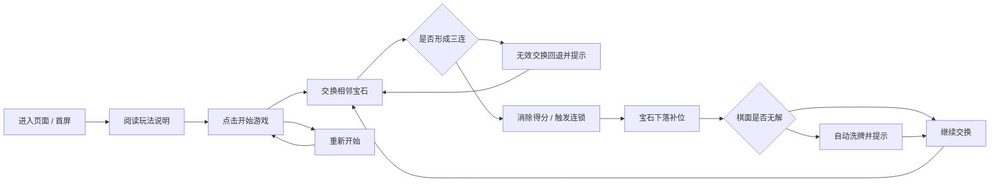
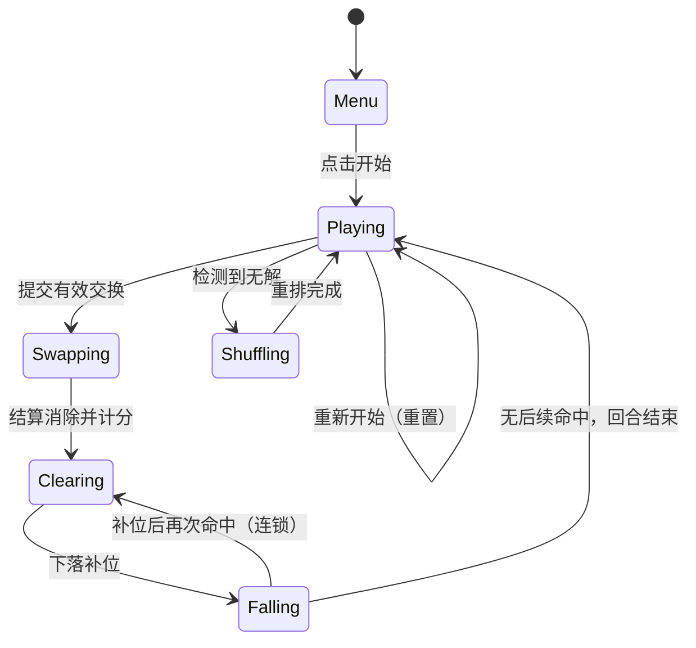

# 产品设计：消消乐（三消）Web 在线小游戏 · DeepSeek-V4.1-Flash

## 1. 制品元数据

- artifact_type: product_design
- activity_key: product_design.work.1
- activity_id: c310873a-a6b0-41b0-90a8-82a8c5618fee
- stage: product_design
- stage_run_id: 70359fa6-d9c9-4757-bb9a-9be8a8d8a360
- workflow_id: a3d16e35-bd65-41e1-b430-995f7151e2a6
- input_manifest_sha256: e15d3c7c8c3abea796a2eff699acc59903fafcec3aec900232a708bed0154039
- request_intent_sha256: 00dfa36e3753a97646e548a18a47d92724a83233e149c19960c74f7883e24a7c
- generation: 1
- primary_repo: https://github.com/sideline8318/snake-loop
- project_name: snake-loop-competition
- product_display_title: 消消乐 · 3D 三消

本制品以输入清单（sha256=e15d3c7c8c3abea796a2eff699acc59903fafcec3aec900232a708bed0154039）与请求意图（sha256=00dfa36e3753a97646e548a18a47d92724a83233e149c19960c74f7883e24a7c）为上游输入，将"方格棋盘上交换相邻方块、三连及以上消除得分、消除后下落补位、无解自动洗牌"的玩法诉求，转化为可实施的玩法设计、交互设计、信息架构与状态机，并给出需求到验收标准的完整映射。

## 2. 产品定位与设计目标

### 2.1 一句话定位

一款零后端依赖、打开即玩的 3D 三消休闲游戏：在 8x8 宝石棋盘上点击或拖动交换相邻宝石，凑成三个及以上同色连线即可消除得分，消除后宝石自动下落补位并可触发连锁，棋面无解时自动洗牌保证可持续游玩。

### 2.2 设计目标

- G-01 首屏即玩：打开页面后阅读简短说明即可点击"开始游戏"进入，无需登录、无网络请求依赖。
- G-02 玩法一眼可懂：通过"交换相邻宝石、三连消除、下落补位、无解洗牌"四条规则文案，让新玩家在无说明书情况下完成首次消除。
- G-03 操作零歧义：点击交换与拖动滑动两种手势等价可用，无效交换原地回退并给出提示。
- G-04 反馈即时可感：消除加分、连锁倍率、洗牌提示、最高分刷新均在同一屏内可见。
- G-05 视觉清爽：3D 宝石采用高饱和配色与柔和环境光，深色棋盘对比清晰，聚焦消除动作本身。

### 2.3 设计原则

- P-01 单屏即完整战场：HUD 分数区、棋盘画布、菜单/提示弹层在同一视图内，不跨页跳转。
- P-02 手势冗余：点击与滑动双通道触发同一交换逻辑，降低误操作成本。
- P-03 渐进清晰：菜单弹层 → 连续消除 → 提示气泡三段式覆盖新玩家与老玩家两条路径。
- P-04 可持续游玩：任何时刻可"重新开始"；棋面无解时系统自动洗牌，不产生死局。

## 3. 目标用户与场景

| 用户画像 | 典型场景 | 关键诉求 |
| --- | --- | --- |
| 休闲碎片时间玩家 | 通勤、排队时打开浏览器玩几分钟 | 打开即玩、单局无压力 |
| 策略型轻玩家 | 追求连锁与高分 | 连锁倍率可见、最高分可留存 |
| 触屏 / 鼠标用户 | 平板、触屏笔记本或桌面鼠标 | 点击与滑动均可完成全部操作 |
| 演示观摩者 | 展示产品能力与闭环流程 | 首屏可见项目标题与消除过程 |

## 4. 用户旅程设计（user_journey_covered）

### 4.1 旅程总览

### 4.2 分步旅程与触点

| 阶段 | 用户动作 | 系统响应 | 界面触点 | 覆盖需求 |
| --- | --- | --- | --- | --- |
| J-01 到达 | 打开页面 URL | 渲染单页应用，画布与 HUD 就绪，展示菜单弹层 | `<title>`、`<h1>` 主标题、副标题、菜单弹层 | REQ-TITLE-01, REQ-MENU-01 |
| J-02 了解规则 | 阅读菜单说明 | 展示交换、消除、下落、洗牌四条规则 | 菜单弹层规则列表、玩法副标题 | REQ-MENU-02 |
| J-03 开局 | 点击"开始游戏" | 棋盘初始化，分数归零，进入可交互状态 | 菜单弹层关闭、HUD 分数区激活 | REQ-START-01 |
| J-04 交换 | 点击两颗相邻宝石或滑动拖拽 | 记录起点并高亮，交换后即时判定是否成三连 | 棋盘高亮、画布指针事件 | REQ-INPUT-01, REQ-INPUT-02 |
| J-05 无效交换 | 交换后未形成三连 | 交换回退，气泡提示"这样换不能消除哦" | toast 气泡（warn） | REQ-INPUT-03 |
| J-06 消除得分 | 交换形成三连及以上 | 消除对应宝石，按格数计分，分数实时更新 | HUD 当前得分、消除动画 | REQ-MATCH-01, REQ-SCORE-01 |
| J-07 连锁 | 下落补位后再次形成三连 | 连锁层级递增，按倍率加分并提示"连锁 xN" | HUD 连锁标识、toast 气泡（combo） | REQ-MATCH-02, REQ-SCORE-02 |
| J-08 补位 | 宝石被消除 | 上方宝石下落填补空位，顶部生成新宝石 | 下落动画、生成动画 | REQ-FALL-01 |
| J-09 洗牌 | 棋面无可消除组合 | 自动重排棋盘并提示"没有可消除的组合，已自动洗牌" | toast 气泡（shuffle）、棋盘重排动画 | REQ-SHUFFLE-01 |
| J-10 刷新纪录 | 当前得分超过历史最高分 | 最高分本地持久化并在 HUD 更新 | HUD 最高分 | REQ-SCORE-03 |
| J-11 重开 | 点击"重新开始"或按 R | 棋盘与分数重置，立即重新开局 | HUD 重新开始按钮、键盘 R | REQ-RESTART-01 |

### 4.3 旅程闭环判定

- 首次进入 → 阅读规则 → 开局 → 完成至少一次有效消除 → 观察下落与连锁 → 触发或观察洗牌 → 刷新最高分 → 重开，全部步骤在单页内闭合（对齐 P-01、G-01）。
- 无死局保证：J-09 洗牌后必然存在可消除组合，旅程不会中断（对齐 P-04）。

## 5. 玩法设计

### 5.1 棋盘与方块

| 项 | 取值 | 说明 |
| --- | --- | --- |
| 棋盘尺寸 | 8 x 8 | 共 64 格，坐标 row/col 从 0 起 |
| 方块种类 | 6 种 | red / orange / yellow / green / blue / purple |
| 初始棋面 | 无初始三连 | 生成时避开与左侧两格或上方两格同色，保证开局静默 |

### 5.2 核心循环

1. **交换**：仅接受相邻（曼哈顿距离为 1）的两格交换。
2. **判定**：交换后立即全盘扫描横向与纵向连续同色段，长度 >= 3 即命中。
3. **消除计分**：命中格按 `格数 x 基础分 x (1 + 连锁层级 x 连锁加成)` 计分，基础分 10，连锁加成 0.5。
4. **下落补位**：同列内被消除格上方的宝石整体下移，顶部空位生成随机新宝石。
5. **连锁回检**：补位后再次扫描，若命中则连锁层级加一，回到第 3 步；否则本回合结束。
6. **无解洗牌**：回合结束后若全盘不存在任何可形成三连的相邻交换，则重排棋盘直至既无当前三连又存在可行步。

### 5.3 计分与连锁

| 事件 | 计分规则 |
| --- | --- |
| 基础消除 | `消除格数 x 10` |
| 连锁第 N 层 | `消除格数 x 10 x (1 + (N-1) x 0.5)` |
| 连锁展示 | 第 2 层起提示"连锁 xN" |
| 最高分 | 每局结束时与本地历史最高分比较并留存 |

### 5.4 洗牌规则

- 触发条件：当前棋面无任何相邻交换能使全盘产生 >= 3 连线。
- 重排策略：先打乱全盘并校验（无现成三连且存在可行步），最多尝试 200 次。
- 兜底策略：尝试失败时按安全生成规则重建棋盘，仍无解则按 `(row + col) % 种类数` 铺设以保证存在可行步。
- 用户感知：洗牌后以气泡提示，不中断操作。

## 6. 交互设计

### 6.1 输入通道

| 通道 | 操作 | 行为 |
| --- | --- | --- |
| 点击 | 依次点击两颗相邻宝石 | 第二次点击后发起交换判定 |
| 拖动 | 从一颗宝石滑向相邻方向 | 位移超过阈值后按主方向解析目标格并交换 |
| 悬停 | 指针停留在宝石上 | 高亮当前格，离开清除高亮 |
| 键盘 | 按 `R` | 立即重新开始 |

### 6.2 反馈与容错

- 无效交换（不相邻或不成三连）不改变棋盘，弹出提示气泡后恢复可交互。
- 结算动画期间（交换 / 消除 / 下落 / 洗牌）忽略新的输入请求，避免状态竞争。
- 仅高亮允许交互的当前格，视觉上明确"下一步可操作"。

## 7. 信息架构与界面结构

| 区域 | 元素 | 职责 |
| --- | --- | --- |
| 页头 HUD | 品牌眉题、主标题、副标题、重新开始按钮 | 身份与全局操作 |
| 分数区 | 当前得分、最高分、连锁标识 | 进度与激励反馈 |
| 主舞台 | 3D 画布（8x8 宝石）、toast 气泡 | 核心玩法与即时反馈 |
| 菜单弹层 | 规则说明、开始游戏按钮 | 首屏引导 |

## 8. 状态机设计

| 阶段 | 可交互 | 说明 |
| --- | --- | --- |
| Menu | 否 | 展示规则，等待开始 |
| Playing | 是 | 等待玩家交换 |
| Swapping | 否 | 交换生效并扫描命中 |
| Clearing | 否 | 应用消除与计分 |
| Falling | 否 | 应用下落与生成，回检连锁 |
| Shuffling | 否 | 重排至可解 |

## 9. 验收标准映射（acceptance_mapping_covered）

| 契约目标要素 | 承载需求 | 产品设计承载 | 验收判定 |
| --- | --- | --- | --- |
| 浏览器直接打开游玩 | REQ-START-01 | 2.1 定位、J-01/J-03、第 7 节 | AC-001 |
| 方格棋盘 | REQ-BOARD-01 | 5.1 棋盘与方块 | AC-001 |
| 交换相邻方块 | REQ-INPUT-01, REQ-INPUT-02 | 5.2 步骤 1、6.1 输入通道 | AC-002 |
| 三个及以上同色连线消除 | REQ-MATCH-01 | 5.2 步骤 2-3、5.3 计分 | AC-002 |
| 消除得分 | REQ-SCORE-01, REQ-SCORE-02 | 5.3 计分与连锁、J-06/J-07 | AC-002 |
| 上方自动下落补位 | REQ-FALL-01 | 5.2 步骤 4、J-08 | AC-002 |
| 无可消除组合时自动洗牌 | REQ-SHUFFLE-01 | 5.4 洗牌规则、J-09 | AC-003 |
| 轻松易上手、视觉清爽 | REQ-MENU-02, REQ-VISUAL-01 | 2.2 G-02/G-05、第 6-7 节 | AC-004 |
| 可重开与最高分留存 | REQ-RESTART-01, REQ-SCORE-03 | J-10/J-11、5.3 最高分 | AC-004 |

### 9.1 验收标准定义

| AC | 描述 | 验证方式 |
| --- | --- | --- |
| AC-001 | 打开页面即可见标题与 8x8 棋盘，并可进入游戏 | 黑盒检查 title/主标题，检查棋盘渲染与开始按钮 |
| AC-002 | 交换相邻方块可凑三消除、得分、下落补位 | 逻辑单元测试覆盖交换、命中、消除、补位、连锁 |
| AC-003 | 棋面无解时自动洗牌且洗牌后可继续游玩 | 单元测试构造无解棋面，断言洗牌后存在可行步 |
| AC-004 | 交互说明清晰、最高分留存、可随时重开 | 单元测试覆盖最高分持久化与重开重置；黑盒检查说明文案 |

## 10. 非目标与边界

- 不包含联网对战、账号体系、云端排行榜与商业化道具。
- 不包含关卡目标、步数限制与限时模式（本期为无限休闲模式）。
- 目标环境为具备 WebGL 与 ES Module 的现代浏览器；无 WebGL 时不保证渲染可用。

## 11. 追溯

- 上游输入：输入清单 sha256=e15d3c7c8c3abea796a2eff699acc59903fafcec3aec900232a708bed0154039；请求意图 sha256=00dfa36e3753a97646e548a18a47d92724a83233e149c19960c74f7883e24a7c。
- 本制品由 Activity c310873a-a6b0-41b0-90a8-82a8c5618fee 在 Workflow a3d16e35-bd65-41e1-b430-995f7151e2a6 的 product_design 阶段产出，后续技术设计、开发、测试、部署、验收阶段据此实施。
