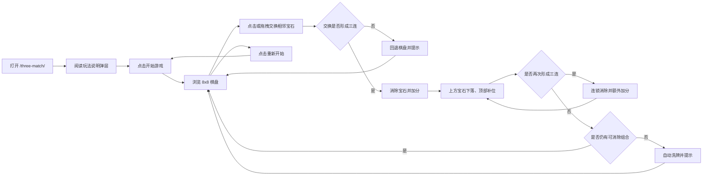
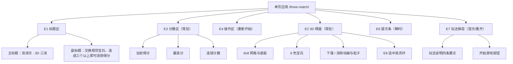
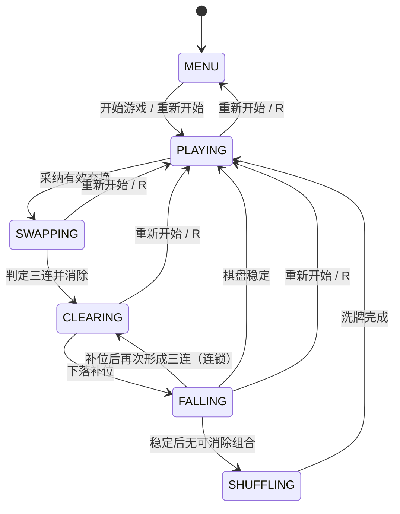

# 产品设计：消消乐（三消）Web 在线小游戏

> 本文件为阶段 product_design（ActivityRun `95cea790-22bb-453b-af15-d0013c17891b`）的权威制品，
> 完整承接需求基线 `ff352105...0cfdc` 与验收标准 AC-001~AC-006；
> 其内容哈希、byte_size 与 artifact_uri 以 `loop.complete_activity` 提交的 ArtifactManifest 为准。

## 1. 制品元数据

- artifact_type: product_design
- artifact_name: three-match-product-design
- activity_key: product_design.work.1
- activity_id: 95cea790-22bb-453b-af15-d0013c17891b
- stage: product_design
- stage_run_id: 9cf5c12e-a543-4383-853b-64253a5cb356
- workflow_id: a3d16e35-bd65-41e1-b430-995f7151e2a6
- input_manifest_sha256: e15d3c7c8c3abea796a2eff699acc59903fafcec3aec900232a708bed0154039
- request_intent_sha256: d53cdc816931c862321cfd05d97169393bdc2b783fa8c956283503bfbd8fd696
- requirement_baseline_sha256: ff35210507ef825f4e3acadb22d1155f07d0b48a37b674c35f8d3a8c9cc0cfdc
- upstream_git_commit_sha: b42f9234eb81dfcff144e6ce2d01b61568a90324
- generation: 1
- primary_repo: https://github.com/sideline8318/snake-loop
- project_name: snake-loop-competition
- product_display_title: 消消乐 · 3D 三消
- implementation_entry: three-match/index.html（源码 src/games/three-match/）

本制品以需求基线 `requirement_baseline`（sha256=ff35210507ef825f4e3acadb22d1155f07d0b48a37b674c35f8d3a8c9cc0cfdc）为唯一上游输入，承接其冻结范围（IN-01~IN-10 / OUT-01~OUT-05 / AS-01~AS-04）与需求条目（REQ-ENTRY-01~REQ-VISUAL-01），将需求转化为可直接实施的产品与交互设计，并给出需求到验收标准（AC-001~AC-006）的完整映射。本阶段不引入任何超出冻结范围的新功能。

### 1.1 前序制品说明

本仓库中曾存在另一份三消产品设计制品 `.monkeycode/specs/snake-loop-competition/product_design_match3.md`，其未绑定 AC-001~AC-006，且自造 REQ 编号与上游需求基线不一致，已随本次提交移除，视为无效制品。本文件为本阶段唯一权威制品，并以需求基线 `ff352105...` 为其上游依赖。

## 2. 产品定位与设计目标

### 2.1 一句话定位

一款零后端依赖、打开即玩的 3D 三消休闲游戏：在 8x8 宝石棋盘上点击或拖动交换相邻宝石，凑成三个及以上同色连线即可消除得分，消除后宝石自动下落补位并可触发连锁，棋面无解时自动洗牌保证可持续游玩。

### 2.2 设计目标

- G-01 打开即玩：浏览器直接访问 `/three-match/` 即进入可交互棋盘，无登录、无安装、无网络请求依赖（对齐 IN-01、AS-02、AC-001）。
- G-02 规则零门槛：首屏弹层用一句话加四条要点说明玩法，新玩家无需说明书即可完成一次消除（对齐 IN-02、IN-03）。
- G-03 操作零歧义：点击两次相邻宝石与拖拽滑动两种手势等价可用，鼠标与触控同时支持（对齐 IN-03、AC-002）。
- G-04 反馈即时可感知：交换采纳、无效回退、消除、连锁、洗牌均在同屏以内、200ms 级可见的方式呈现（对齐 IN-05、IN-06、IN-07）。
- G-05 表现清爽克制：深色底 + 高饱和宝石 + 轻量动效，视觉噪声低，适合休闲短时游玩（对齐 IN-09、REQ-VISUAL-01）。
- G-06 状态自洽：任何时刻棋盘都保证「无现成三连且至少存在一步可消除交换」，杜绝死局（对齐 REQ-BOARD-02、REQ-SHUFFLE-02）。

### 2.3 设计原则

- P-01 单屏闭环：分数、最高分、连锁、棋盘、提示与重开入口同屏共存，不跳页、不弹新窗口。
- P-02 操作即校验：交换先做「试交换 + 匹配判定」，无效即回退，绝不改变得分与棋盘终态。
- P-03 状态机驱动：玩法推进由显式阶段（IDLE→SWAPPING→CLEARING→FALLING）驱动，动画只消费状态，不反向驱动规则。
- P-04 渐进降级：渲染层可选（three.js 3D）；逻辑层与状态层与渲染解耦，WebGL 不可用时玩法依然可判定（对齐 AS-04）。
- P-05 公平锚定：刷新、重开、洗牌后棋盘一律回到「无三连 + 有解」的合法初始态。

## 3. 目标用户与场景

| 用户画像 | 典型场景 | 关键诉求 |
| --- | --- | --- |
| 休闲玩家 | 工作间隙或通勤碎片时间打开即玩 | 上手零成本、单局时长自由、无压力 |
| 触屏 / 移动设备用户 | 手机、平板浏览器访问 | 滑动即可交换，按钮与棋盘适配窄屏 |
| 桌面鼠标用户 | 电脑浏览器访问 | 点击两颗相邻宝石即可完成交换 |
| 演示 / 观摩者 | 展示产品能力与闭环 | 首屏可见产品标题、棋盘与计分过程 |

## 4. 用户旅程设计（user_journey_covered）

### 4.1 旅程总览

### 4.2 分步旅程与触点

| 阶段 | 用户动作 | 系统响应 | 界面触点 | 覆盖需求 |
| --- | --- | --- | --- | --- |
| J-01 到达 | 打开 `/three-match/` URL | 单页加载，标题与 3D 棋盘渲染就绪，弹出玩法弹层 | `E1` 标题区、`E2` 棋盘、`E7` 玩法弹层 | REQ-ENTRY-01, REQ-ENTRY-02, AC-001 |
| J-02 了解规则 | 阅读弹层说明 | 展示交换方式、回退规则、下落连锁、自动洗牌四条要点 | `E7` 玩法弹层文案 | IN-02, IN-03, IN-06, IN-07 |
| J-03 开局 | 点击「开始游戏」 | 弹层关闭，棋盘进入可交互态，分数归零 | `E7` 开始按钮、`E3` 分数区 | REQ-RESTART-01, IN-02 |
| J-04 观察棋盘 | 浏览 8x8 棋盘 | 展示 6 色宝石，且不存在现成三连、至少一步有解 | `E2` 棋盘 | REQ-BOARD-01, REQ-BOARD-02, AC-002 |
| J-05 交换 | 点击两颗相邻宝石，或按住滑动一格 | 采纳交换并进入判定；非相邻或不产生消除则回退 | `E2` 棋盘手势层、`E8` 高亮环 | REQ-INPUT-01, REQ-INPUT-02, REQ-INPUT-03, AC-002 |
| J-06 消除得分 | 交换形成三连及以上 | 消除对应宝石、按格数与连锁倍率加分、播放爆裂粒子 | `E3` 分数区、`E2` 消除动效 | REQ-MATCH-01, REQ-SCORE-01, AC-003 |
| J-07 无效回退 | 交换不产生消除 | 棋盘回退原位，提示「这样换不能消除哦」 | `E6` 提示条 | REQ-INPUT-03, AC-003 |
| J-08 下落补位 | 观察消除后的棋盘 | 上方宝石下落至空位、顶部生成新宝石 | `E2` 下落动画 | REQ-CASCADE-01, AC-004 |
| J-09 连锁 | 下落补位后再次形成三连 | 继续消除并按连锁层数额外加分，提示「连锁 xN」 | `E3` 连锁计数、`E6` 提示条 | REQ-CASCADE-02, REQ-SCORE-01, AC-004 |
| J-10 自动洗牌 | 棋盘无可消除组合时继续操作 | 自动洗牌并提示「没有可消除的组合，已自动洗牌」 | `E6` 提示条、`E2` 棋盘重排 | REQ-SHUFFLE-01, REQ-SHUFFLE-02, AC-005 |
| J-11 刷新纪录 | 当前得分超过历史最高分 | 最高分本地持久化并实时更新 | `E3` 最高分 | REQ-SCORE-02, AC-006 |
| J-12 重开 | 点击「重新开始」 | 棋盘与分数重置，回到可开局状态 | `E4` 重新开始按钮 | REQ-RESTART-01, AC-006 |
| J-13 循环 | 重复 J-03~J-12 | 每局可独立完成，无残留状态 | 全流程 | IN-10, REQ-QUALITY-01 |

### 4.3 关键旅程的异常与边界路径

- JX-01 非相邻交换：在 8x8 棋盘上点击不相邻的两颗宝石，请求被拒绝并提示「只能交换相邻的宝石」，棋盘与分数不变（REQ-INPUT-02）。
- JX-02 无效交换回退：交换相邻但两端都无三连，棋盘回退原布局，得分不增加，提示「这样换不能消除哦」（REQ-INPUT-03、AC-003）。
- JX-03 动画期间输入：处于 `SWAPPING / CLEARING / FALLING` 阶段时输入被忽略，不接受新交换，避免规则竞争（P-03）。
- JX-04 多步连锁：一次交换触发连续多轮消除时，连锁计数逐轮递增，倍率按连锁层数叠加，直至无新三连（REQ-CASCADE-02）。
- JX-05 死局洗牌：棋盘无任何可消除交换组合时自动洗牌，结果保证「无现成三连 + 至少一步有解」，不产生二次死局（REQ-SHUFFLE-02）。
- JX-06 初始即死局：开局生成棋盘后若检测到无解，立即静默洗牌至合法态（REQ-BOARD-02）。
- JX-07 存储不可用：localStorage 被禁用或读取失败时，最高分降级为内存态 0，不抛异常、不中断游戏（AS-03、REQ-QUALITY-01）。
- JX-08 无 WebGL 环境：渲染层初始化失败时玩法判定与计分逻辑仍可运行，页面不出现未捕获控制台报错（AS-04、REQ-QUALITY-01）。

### 4.4 旅程可达性结论

全部 13 个主线步骤与 8 条异常/边界路径均可在单页内完成，无需登录、网络请求或跨页跳转，与冻结范围 IN-01、OUT-01~OUT-05、AS-02、AS-04 一致。

## 5. 玩法设计

### 5.1 棋盘与元素

- 棋盘为 8x8 网格（`BOARD_SIZE=8`），每格取值为 6 种宝石之一（`GEM_KINDS=6`），宝石标识为 `red / orange / yellow / green / blue / purple`（REQ-BOARD-01）。
- 棋盘生成采用「安全取值」策略：逐格填充时排除会与左侧两格或上方两格构成三连的颜色，从源头保证初始无现成三连（REQ-BOARD-02、P-05）。
- 生成完成后校验「至少存在一步可消除交换」，不满足则静默洗牌（JX-06、REQ-SHUFFLE-02）。

### 5.2 交换与匹配

- 交换仅允许上下左右相邻（曼哈顿距离为 1）的两颗宝石；非相邻请求直接拒绝（REQ-INPUT-01、REQ-INPUT-02）。
- 交换采用「试交换 + 判定」：在棋盘副本上执行交换并做匹配扫描，命中三连及以上才落定，否则回退（REQ-INPUT-03、P-02）。
- 匹配规则：逐行、逐列扫描连续同色段，长度达到 3 即判定为一组消除，支持 4 连、5 连与 L 形、T 形等交叉组合（REQ-MATCH-01）。
- 同一次判定中横竖交叉的宝石按并集去重，只计算一次消除格数（避免重复计分）。

### 5.3 下落与连锁

- 消除后将对应格子置空，随后按列自底向上压实：上方宝石下落填充空位，列顶空出的格子补充新宝石（REQ-CASCADE-01、`collapse`）。
- 补位后再次执行匹配扫描；若形成新的三连，则继续消除并累计连锁层数，直到棋盘稳定（REQ-CASCADE-02）。
- 每轮稳定后重新检测是否仍有可消除组合，无则触发洗牌（REQ-SHUFFLE-01）。

### 5.4 计分规则

- 基础分：`BASE_SCORE=10`，单轮基础分 = 该轮消除格数 x 10（REQ-SCORE-01）。
- 连锁倍率：第 N 层连锁（N 从 1 起）额外叠加 `CASCADE_BONUS=0.5` 倍，即单轮得分 = 消除格数 x 10 x (1 + (N-1) x 0.5)，结果四舍五入取整。
- 连锁计数 `combo` 在无新三连时归零；HUD 仅在 `combo > 1` 时显示 `xN`，否则显示占位符 `—`。
- 最高分基于当前得分本地持久化，键为 `three-match-best-score`；仅当本次得分超过历史最高分时写入并更新展示（REQ-SCORE-02、AS-03）。

### 5.5 洗牌规则

- 触发条件：棋盘不存在任何「一次交换即可形成三连」的组合（`hasPossibleMove` 为假）。
- 洗牌算法：反复打乱当前宝石集合直至同时满足「无现成三连」与「至少一步有解」；达到尝试上限后按安全取值重建，并以确定性排列兜底，保证必然返回合法态（REQ-SHUFFLE-01、REQ-SHUFFLE-02）。
- 洗牌后给出文字提示「没有可消除的组合，已自动洗牌」，不改变当前得分。

### 5.6 重新开始

页头「重新开始」按钮触发重置：重新生成棋盘、得分归零、连锁归零、阶段回到 `IDLE`，并提示「新的一局，开始吧！」；键盘 `R` 键为等价快捷入口（REQ-RESTART-01、IN-08）。

### 5.7 规则边界与公平性

- 所有交换使用同一判定路径，不存在特殊宝石或道具，规则对每颗宝石一致。
- 无效交换不产生任何副作用（分数、连锁、统计均不变），玩家可无限次重试。
- 任何时刻棋盘都处于「无三连 + 有解」的合法态，玩家不会遇到无法继续的死局。

## 6. 交互设计

### 6.1 控制通道映射

| 通道 | 操作方式 | 有效范围 | 边界保护 |
| --- | --- | --- | --- |
| 点击交换 | 先点选一颗宝石（出现高亮环），再点击其上下左右相邻宝石 | 仅 `PLAYING + IDLE` 阶段 | 非相邻拒绝并提示；再次点击同一格取消选中 |
| 拖拽交换 | 在宝石上按住并向四个方向滑动超过阈值（约 14px） | 仅 `PLAYING + IDLE` 阶段 | 滑动距离不足视为点选；解析为最近的主方向邻居 |
| 键盘重开 | `R` / `r` | 全局 | 触发与「重新开始」按钮一致的重置 |
| 按钮重开 | 点击「重新开始」 | 全局 | 同上，并关闭玩法弹层 |

指针事件统一使用 `pointerdown / pointermove / pointerup`，同时覆盖鼠标与触控；棋盘画布设置 `touch-action: none` 以避免误触页面滚动。

### 6.2 信息架构

### 6.3 界面元素清单

| 元素 ID | 名称 | 可见时机 | 关键内容 | 覆盖需求 |
| --- | --- | --- | --- | --- |
| E1 | 标题区 | 常驻 | 主标题 `消消乐 · 3D 三消`、英文眉题、副标题 | REQ-ENTRY-02 |
| E2 | 3D 棋盘 | 常驻 | 8x8 网格底板、6 色宝石、下落/消除动画与爆裂粒子 | REQ-BOARD-01, REQ-VISUAL-01 |
| E3 | 分数区 | 常驻 | 当前得分、最高分、连锁计数 | REQ-SCORE-01, REQ-SCORE-02 |
| E4 | 操作区 | 常驻 | 「重新开始」按钮 | REQ-RESTART-01 |
| E5 | 页脚 | 常驻 | 产品标识与工作流标记 | REQ-ENTRY-02 |
| E6 | 提示条 | 瞬时（约 1.6s） | 交换提示、连锁提示、洗牌提示 | REQ-INPUT-03, REQ-CASCADE-02, REQ-SHUFFLE-02 |
| E7 | 玩法弹层 | 首屏与重开后 | 玩法四条要点与「开始游戏」按钮 | IN-02, IN-03 |
| E8 | 选中高亮环 | 选中宝石时 | 选中态高亮与悬浮态高亮 | REQ-INPUT-01 |

### 6.4 交互反馈规则

- 选中反馈：点选宝石立即出现高亮环，悬浮经过的格子使用次级高亮色区分。
- 交换采纳：采纳的交换即时改变棋盘布局并进入消除流程，无额外确认步骤。
- 无效回退：不产生消除的交换不改变棋盘终态，提示条以警示色显示「这样换不能消除哦」。
- 消除反馈：消除宝石播放放大旋转淡出动效并触发同色爆裂粒子。
- 下落反馈：下落的宝石按缓出曲线插值到目标格，顶部新宝石带落下与缩放入场。
- 连锁反馈：连锁层数大于 1 时，HUD 连锁计数显示 `xN`，并提示「连锁 xN」。
- 洗牌反馈：洗牌后提示「没有可消除的组合，已自动洗牌」，棋盘整体重排。
- 重开反馈：重置后提示「新的一局，开始吧！」，分数与连锁归零。
- 提示条使用 `role="status"` 与 `aria-live="polite"`，不打断当前操作。

### 6.5 状态机设计

状态约束：`canInteract()` 仅在 `PLAYING + IDLE` 为真；`SWAPPING / CLEARING / FALLING / SHUFFLING` 阶段的输入被忽略；符号 `PLAYING` 对应空阶段（`IDLE`），即「等待玩家操作」的稳定态。

### 6.6 响应式与可访问性

- 布局：桌面端棋盘居中并限制最大高度（约 66vh），HUD 采用两列网格；窄屏（<560px）HUD 改为纵向堆叠且分数卡横向三等分。
- 触控：画布设置 `touch-action: none`，指针事件统一处理；滑动超过阈值才判为交换，降低误触。
- 语义：画布带 `aria-label="3D 三消游戏棋盘"`，提示条 `role="status"` + `aria-live="polite"`，开始按钮为原生 `button`。
- 视觉：深色底配高饱和宝石与柔和辉光，动效时长控制在约 0.3~0.7s，避免视觉过载与眩晕。

## 7. 需求到验收标准的映射（acceptance_mapping_covered）

### 7.1 验收标准映射表

| 验收标准 ID | 描述 | 产品设计承载章节 | 覆盖需求条目 | 验证方式 |
| --- | --- | --- | --- | --- |
| AC-001 | 使用浏览器直接打开页面（如 index.html）即可开始游戏，无需本地构建或安装依赖 | 4.2 J-01、5.1、6.3 E1/E2 | REQ-ENTRY-01, REQ-ENTRY-02 | 黑盒检查 dist 产物与 HTTP 200 服务 |
| AC-002 | 棋盘为 8x8 或类似方格布局，初始不存在现成三连；玩家通过点击或拖拽交换相邻方块 | 5.1、5.2、6.1、6.3 E2/E8 | REQ-BOARD-01, REQ-BOARD-02, REQ-INPUT-01, REQ-INPUT-02 | 单元测试 + 黑盒检查 |
| AC-003 | 交换后形成三个及以上同色连线则消除并加分；无效交换需回退并提示 | 5.2、5.4、6.4 | REQ-MATCH-01, REQ-SCORE-01, REQ-INPUT-03 | 单元测试覆盖引擎 |
| AC-004 | 消除后上方方块自动下落、顶部补充新方块，支持连锁消除 | 5.3、5.4、6.4 | REQ-CASCADE-01, REQ-CASCADE-02 | 单元测试覆盖引擎 |
| AC-005 | 棋盘无可消除组合时自动洗牌并给出提示 | 5.5、6.4 | REQ-SHUFFLE-01, REQ-SHUFFLE-02 | 单元测试覆盖引擎 |
| AC-006 | 页面展示当前分数并提供重新开始按钮；游戏过程无 JS 控制台报错 | 5.4、5.6、6.3 E3/E4、6.6 | REQ-SCORE-02, REQ-RESTART-01, REQ-QUALITY-01 | 黑盒检查 + lint/typecheck/test/build |

附加需求 REQ-VISUAL-01（three.js 3D 渲染与动画）由本设计 6.2 E2、6.4 与 6.6 承载，归属 IN-09，由 AC-006 的运行期无报错与黑盒产物检查共同佐证，不单独占用验收标准 ID。

### 7.2 双向覆盖核验

- AC-001 对应本设计 4.2 J-01 与 6.3 E1/E2，入口与标题显式承载；REQ-ENTRY-01、REQ-ENTRY-02 均可回溯到本设计章节。
- AC-002 对应本设计 5.1、5.2、6.1、6.3，4 条需求条目全部命中。
- AC-003 对应本设计 5.2、5.4、6.4，3 条需求条目全部命中。
- AC-004 对应本设计 5.3、5.4、6.4，2 条需求条目全部命中。
- AC-005 对应本设计 5.5、6.4，2 条需求条目全部命中。
- AC-006 对应本设计 5.4、5.6、6.3、6.6，3 条需求条目全部命中。
- 反向核验：本设计无超出需求基线冻结范围的新增功能诉求，OUT-01~OUT-05 排除项（联机、关卡、音效、原生 App、服务端持久化）均未被引入。

### 7.3 契约目标覆盖核验

| 契约目标要素 | 产品设计承载 | 判定 |
| --- | --- | --- |
| 浏览器直接打开游玩 | 2.1、4.2 J-01、6.3 E1/E2 | 覆盖 |
| 方格棋盘 | 5.1 8x8 网格、6.3 E2、REQ-BOARD-01 | 覆盖 |
| 交换相邻方块 | 5.2 交换与匹配、6.1 点击/拖拽、REQ-INPUT-01/02 | 覆盖 |
| 三连及以上消除得分 | 5.2 匹配规则、5.4 计分规则、REQ-MATCH-01、REQ-SCORE-01 | 覆盖 |
| 上方自动下落补位 | 5.3 下落与连锁、REQ-CASCADE-01 | 覆盖 |
| 无可消除组合自动洗牌 | 5.5 洗牌规则、REQ-SHUFFLE-01/02 | 覆盖 |
| 轻松易上手、视觉清爽 | 2.2 G-02/G-05、6.4 反馈规则、6.6 视觉规范 | 覆盖 |

## 8. 追溯与下行交付约定

### 8.1 本阶段追溯链

- 上游输入：requirement_baseline，sha256=ff35210507ef825f4e3acadb22d1155f07d0b48a37b674c35f8d3a8c9cc0cfdc。
- 本制品：product_design，由本文件内容计算 sha256 与 byte_size，并登记 artifact_uri、input_manifest_sha256=e15d3c7c8c3abea796a2eff699acc59903fafcec3aec900232a708bed0154039 与 activity_id=95cea790-22bb-453b-af15-d0013c17891b。
- 追溯关系：input_manifest_to_artifact（e15d3c7c...到本制品）、artifact_to_commit（本制品到本阶段提交 SHA）。
- 承载检查：user_journey_covered（第 4 章）、acceptance_mapping_covered（第 7 章）。

### 8.2 对本阶段之后交付的约定

- 实现须沿用本设计的实体与命名：`GameState`、`BoardView`、`createInput`、`Hud`、`GAME`、`HUD`、`SCENES`、`PHASE`、`E1~E8` 元素 ID 与 `three-match-best-score` 存储键。
- 实现须保留 `src/games/three-match/board.js` 的纯函数边界（`createBoard / findMatches / collapse / hasPossibleMove / shuffleBoard / scoreFor`），以保证规则层的可测试性。
- 实现须满足 6.1 全部控制通道、6.4 全部反馈规则与 6.5 状态机约束，且不引入 OUT-01~OUT-05 排除项。
- 保持既有贪吃蛇功能不回归，多页面构建产物保持 `dist/index.html` 与 `dist/three-match/index.html`。

### 8.3 本阶段完成定义

- DOD-01 required_checks（user_journey_covered、acceptance_mapping_covered）均通过并附证据。
- DOD-02 本制品登记 artifact_uri、byte_size 与 SHA-256，并声明输入清单哈希与 Activity ID。
- DOD-03 本文件提交至 primary 仓库 main 分支，后续阶段以同一 input_manifest_sha256 引用。

## 9. 范围与风险声明

- 本设计严格限定范围为单机单人 3D 三消，联机对战、排行榜、关卡与限时模式、音效音乐、原生客户端与服务端持久化均在本期范围之外（OUT-01~OUT-05）。
- 3D 渲染为增强表现层：沙箱无 GPU/真实浏览器，three.js 仅验证到模块导入与场景图构建层面，实际 WebGL 像素渲染需在真实浏览器中确认（沿用上游 open_risk）。
- 平台预览入口仅提供 HTTP，HTTPS 变体受平台代理 TLS 配置影响，属既有平台限制（沿用上游 open_risk）。
- 洗牌与初始生成依赖随机性，测试须以可注入的随机源覆盖「无三连」「有解」「死局洗牌」三类断言，避免偶发用例不稳定（JX-05、JX-06）。
