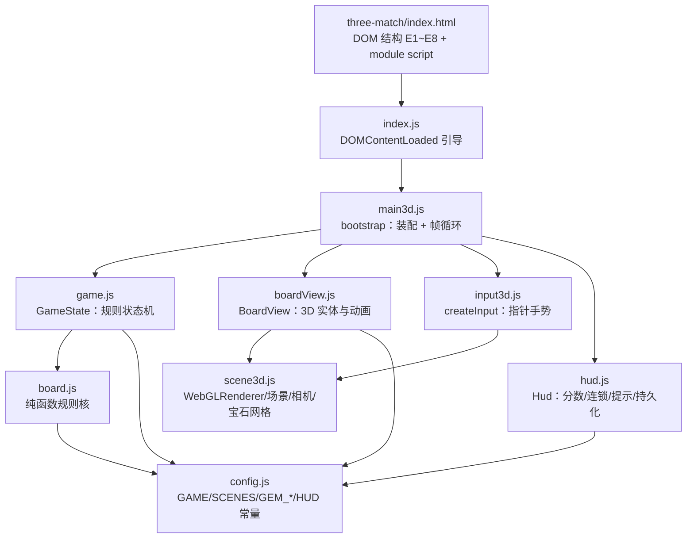

# 技术设计：消消乐（三消）Web 在线小游戏

> 本文件为阶段 technical_design（ActivityRun `f38b4b40-f79e-4083-8e1f-4abce19a40cb`）的权威制品，
> 直接承接产品设计基线（sha256=`9b344dff044976d46f6d8a509835a3fd68efc46d8c2c44ae1590f33320cc0fc4`，
> ActivityRun `95cea790-22bb-453b-af15-d0013c17891b`）与验收标准 AC-001~AC-006；
> 其内容哈希、byte_size 与 artifact_uri 以 `loop.complete_activity` 提交的 ArtifactManifest 为准。

## 1. 制品元数据

- artifact_type: technical_design
- artifact_name: three-match-technical-design
- activity_key: technical_design.work.1
- activity_id: f38b4b40-f79e-4083-8e1f-4abce19a40cb
- stage: technical_design
- stage_run_id: d6d315b8-b391-46a1-9618-9c6b39cc4771
- workflow_id: a3d16e35-bd65-41e1-b430-995f7151e2a6
- input_manifest_sha256: 9ab024f784119e92bc88487e6c8c23d0b0bd95c4e279087784939a1fab625ff3
- request_intent_sha256: 499921999f08dd706ed035d996f271b80538711719629312d96e9fff3871042e
- upstream_baseline_sha256: 9b344dff044976d46f6d8a509835a3fd68efc46d8c2c44ae1590f33320cc0fc4
- upstream_git_commit_sha: 44ed3624837a3c23194d27af14919982214a592b
- generation: 1
- primary_repo: https://github.com/sideline8318/snake-loop
- project_name: snake-loop-competition
- product_display_title: 消消乐 · 3D 三消
- implementation_entry: three-match/index.html（源码 src/games/three-match/）
- build_output: dist/three-match/index.html

本制品以产品设计基线 `9b344dff...0fc4` 为唯一上游输入，将其玩法与交互设计落地为可实施、可测试、可回滚的工程架构，对齐冻结范围与 AC-001~AC-006。本阶段不引入任何超出上游设计的新功能。

## 2. 技术目标与约束

### 2.1 技术目标

- T-01 零后端零依赖：纯静态前端产物，浏览器直接打开 `three-match/index.html` 即可游玩，无网络请求、无登录、无服务端（对齐 IN-01、IN-10、AC-001）。
- T-02 规则层纯函数：棋盘生成、匹配、下落、洗牌、计分全部实现为无副作用纯函数，可脱离 DOM 与 WebGL 单独测试（对齐 product_design 8.2）。
- T-03 渲染可降级：three.js 3D 渲染为增强层，逻辑与状态层不依赖 WebGL；渲染不可用时玩法判定仍可运行且不抛未捕获错误（对齐 AS-04、AC-006）。
- T-04 状态机驱动：消除流程由显式 `PHASE` 阶段推进，动画只消费状态、不反向驱动规则，输入在非空闲阶段被忽略（对齐 product_design 6.5、P-03）。
- T-05 可确定性测试：随机源可注入（`random` 参数），使「无三连」「有解」「死局洗牌」三类断言稳定可复现（对齐上游 open_risk）。
- T-06 多页构建兼容：与既有贪吃蛇入口共存，构建产物保持 `dist/index.html` 与 `dist/three-match/index.html`，且不回归既有功能（对齐 product_design 8.2）。

### 2.2 技术约束

- C-01 运行时仅依赖现代浏览器（ES Module、Canvas 2D 无关、WebGL 可选），无服务端组件。
- C-02 构建工具链沿用仓库既有的 Vite 6 + vitest + node:test + eslint + tsc。
- C-03 命名与实体沿用上游设计约定：`GameState`、`BoardView`、`createInput`、`Hud`、`GAME`、`HUD`、`SCENES`、`PHASE`、`E1~E8` 与存储键 `three-match-best-score`。
- C-04 纯函数边界沿用：`createBoard / findMatches / collapse / hasPossibleMove / shuffleBoard / scoreFor`。
- C-05 不引入 OUT-01~OUT-05 排除项（联机、账号与排行、原生客户端、商业化、社交）。

## 3. 总体架构

### 3.1 分层架构

分层职责自下而上：

| 层 | 模块 | 职责 | 依赖 |
| --- | --- | --- | --- |
| 常量层 | `config.js` | 棋盘尺寸、宝石种类、计分与连锁系数、颜色、场景与 HUD 元素 ID | 无 |
| 规则核（纯函数） | `board.js` | 安全建盘、匹配扫描、下落补位、有解探测、洗牌、计分 | `config.js` |
| 状态层 | `game.js` | `GameState` 状态机、交换判定、`PHASE` 推进、分数与统计 | `board.js`、`config.js` |
| 渲染层 | `scene3d.js`、`boardView.js` | three.js 场景、宝石网格、下落/消除/粒子动画、高亮环 | three.js、`config.js` |
| 输入层 | `input3d.js` | 射线拾取格位、点击与拖拽解析、键盘重开 | three.js、`scene3d.js` |
| 视图层 | `hud.js` | DOM HUD 刷新、提示条、最高分持久化 | `config.js` |
| 装配层 | `main3d.js`、`index.js` | 依赖装配、`requestAnimationFrame` 帧循环、事件桥接、测试句柄 | 以上全部 |

### 3.2 与产品设计状态机的映射

| product_design 阶段 | 实现 `PHASE` | 触发 | 处理函数 |
| --- | --- | --- | --- |
| IDLE（等待操作） | `PHASE.IDLE` | `start()` / 稳定后回落 | `trySwap()` 可受理 |
| SWAPPING | `PHASE.SWAPPING` | `trySwap()` 采纳有效交换 | `tick()` 首轮匹配并计分、置空 |
| CLEARING | `PHASE.CLEARING` | `tick()` 判定命中后 | `tick()` 执行 `collapse` 补位 |
| FALLING | `PHASE.FALLING` | `tick()` 补位完成 | `tick()` 再匹配（连锁）或稳定回落 |
| SHUFFLING | `PHASE.SHUFFLING` | `ensurePlayable()` | `tick()` 收尾回 `IDLE` |

`canInteract()` 仅在 `SCENES.PLAYING && PHASE.IDLE` 为真，与上游 6.5 状态约束一致；`MENU` 场景由 `menuOverlay` 承载，`startBtn` 关闭弹层并调用 `start()`。

## 4. 数据模型与核心算法

### 4.1 数据结构

- 棋盘：`number[size][size]`，元素为宝石种类索引 `0 ~ GEM_KINDS-1`；消除过程中以 `null` 表示空格（见 `collapse`、`applyClears`）。`size=8`、`kinds=6`。
- 宝石颜色映射：`GEM_IDS = ['red','orange','yellow','green','blue','purple']` 与 `GEM_COLORS` 一一对应；HUD 与 3D 网格共用同一索引语义。
- 游戏状态 `GameState` 字段：`random`（可注入随机源）、`size`、`kinds`、`board`、`score`、`best`、`combo`、`scene`、`phase`、`pendingAction`、`toasts`、`lastEvents`，以及统计量 `swapCount`、`shuffleCount`、`matchCount`。
- 事件对象（`tick()` 返回、`BoardView.applyEvents()` 消费）：`{type:'clear', cells, groups, combo, score}` 与 `{type:'fall', falls, spawns}`；`falls = {from:{row,col}, to:{row,col}}`，`spawns = {row,col,offset}`。

### 4.2 建盘：安全取值 `createBoard` / `pickSafeKind`

逐格填充，填入前排除会与左邻两格或上邻两格构成三连的颜色，从源头保证初始无现成三连（product_design 5.1）。`pickSafeKind` 收集被禁颜色后从剩余候选中按注入随机源取值，候选为空时兜底返回 `0`。该策略使初始棋盘必然无三连，无需事后回滚。

### 4.3 匹配：`findMatches`

对棋盘逐行、逐列扫描连续同色段，长度 `>= 3` 记为一组。实现以 `Set` 收集 `row:col` 去重，输出 `{ cells, groups }`：`groups[i] = { orientation:'row'|'col', cells }` 保留分组用于渲染与计分，`cells` 为横竖交叉并集，保证同一格只消一次、不重复计分（product_design 5.2）。`null` 视为不参与匹配。

### 4.4 下落补位：`collapse`

按列自底向上压实：从底行向上扫描，遇到非空宝石则写入 `writeRow` 并置原格为 `null`，记录 `falls`；压实后列顶空位逐格补充新宝石（`Math.floor(random()*kinds)`），记录 `spawns` 及入场 `offset`。返回 `{ falls, spawns }` 供渲染层播放动画。补位后 `FALLING` 阶段再次调用 `findMatches` 形成连锁（product_design 5.3）。

### 4.5 有解探测：`hasPossibleMove`

在棋盘副本上枚举全部右邻与下邻交换，执行交换后 `findMatches`，命中即回滚并返回 `true`；全部枚举无命中返回 `false`。该函数是死局判定与洗牌终止条件的唯一依据（product_design 5.5）。

### 4.6 洗牌：`shuffleBoard`

反复 Fisher–Yates 打乱当前宝石集合，直至同时满足「无现成三连」且「至少一步有解」，上限 200 次。超限则用 `pickSafeKind` 安全重建，若重建后仍无解则以确定性排列 `(row+col) % kinds` 兜底，保证必然返回合法态、不产生二次死局（product_design 5.5、JX-05）。洗牌由 `GameState.ensurePlayable(silent)` 调用并递增 `shuffleCount`，非静默时产生洗牌提示事件。

### 4.7 计分：`scoreOf` / `scoreFor`

单轮基础分 = 消除格数 × `BASE_SCORE(10)`；连锁第 N 层（N 从 1 起）叠加 `CASCADE_BONUS(0.5)` 倍，即 `round(cells * 10 * (1 + (N-1) * 0.5))`。`combo` 在无新三连时归零，HUD 仅在 `combo > 1` 时显示 `xN`（product_design 5.4）。`board.js#scoreFor(groups, cascade)` 为纯函数形式，`game.js` 内 `scoreOf` 与实现一致，便于单测双通道覆盖。

## 5. 交互与渲染实现

### 5.1 输入解析：`input3d.js`

- 格位拾取：`cellFromEvent` 用 `Raycaster` 与水平面 `Plane(y=0)` 求交，将世界坐标按 `offset=(size-1)/2` 四舍五入映射为 `{row,col}`，越界返回 `null`。
- 拖拽：`pointerdown` 记录起点与屏幕坐标，`pointermove` 超过 14px 阈值即按主轴方向解析为相邻格并触发 `attempt`。
- 点击：`click` 维护 `startCell` 选中态，第二次点击非相邻格由 `GameState.trySwap` 拒绝。
- 键盘：`keydown` 的 `R/r` 触发 `game.start()` 重开。
- 事件统一使用 `pointerdown/pointermove/pointerup/click`，画布 `touch-action:none`，同时覆盖鼠标与触控（product_design 6.1）。

### 5.2 渲染与动画：`scene3d.js` / `boardView.js`

- `buildScene` 创建 `WebGLRenderer`（antialias、ACES 色调映射、软阴影）与透视相机、环境光/方向光/点光、雾效和底板。
- `BoardView` 持有 `Map<"row:col", entity>`：每个实体含 `mesh`、`kind`、`target/from`、`progress`、`speed`。`applyEvents` 消费 `clear`（爆裂粒子 + 放大旋转淡出）与 `fall`（插值下落、顶部缩放入场）事件。
- `update(dt)` 用 `easeOutCubic` 推进补间与粒子重力，空闲宝石叠加呼吸浮动与缓慢自转；`highlightCell/clearHighlight` 提供选中与悬浮高亮环（`E8`）。
- 渲染层可降级：状态与事件流不依赖渲染成功；WebGL 不可用时玩法判定与计分仍成立（T-03、AS-04）。

### 5.3 HUD 与持久化：`hud.js`

- 通过 `HUD` 常量 ID 绑定 `#score / #bestScore / #combo / #toast / #restartBtn / #startBtn / #menuOverlay`，`refresh()` 刷新分数、最高分、连锁（`>1` 显示 `xN`，否则 `—`）。
- 最高分键 `three-match-best-score`：`loadBest` 读取并容错，`saveBest` 仅在超过历史值时写入；`localStorage` 不可用或抛异常时降级为内存态 `0`，不中断游戏（AS-03、JX-07）。
- `toast(text, tone)` 复用 `#toast`，`role="status"` + `aria-live="polite"`，1.6s 后收起；覆盖「只能交换相邻的宝石」「这样换不能消除哦」「连锁 xN」「没有可消除的组合，已自动洗牌」「新的一局，开始吧！」等反馈（product_design 6.4）。

### 5.4 装配与帧循环：`main3d.js`

- `bootstrap({canvas})` 装配 `buildScene / GameState / BoardView / Hud / createInput`，绑定开始与重开回调，注册 `resize`，启动 `requestAnimationFrame` 帧循环。
- 帧循环在 `PLAYING` 且 `game.busy` 时按约 0.22s 节流调用 `game.tick()` 并 `boardView.applyEvents()`、`hud.refresh()`；稳定态定期巡检 `hasPossibleMove` 触发自动洗牌。
- 暴露 `globalThis.__THREE_MATCH__` 测试句柄（`game/boardView/hud/input/dispose`），供集成测试在不依赖真实渲染的前提下驱动状态。

## 6. 需求、验收与契约映射

### 6.1 上游需求到技术实现映射

| 上游需求 | 技术实现载体 | 关键函数/模块 |
| --- | --- | --- |
| REQ-ENTRY-01/02 | 入口页面与标题、module script | `three-match/index.html`、`index.js` |
| REQ-BOARD-01 | 8×8 网格、6 色宝石 | `config.GAME`、`board.createBoard` |
| REQ-BOARD-02 | 初始无三连、必有解 | `pickSafeKind`、`hasPossibleMove`、`ensurePlayable` |
| REQ-INPUT-01/02/03 | 点击 / 拖拽交换、非相邻拒绝、无效回退 | `input3d`、`GameState.trySwap` |
| REQ-MATCH-01 | 三连及以上、横竖交叉去重 | `findMatches`、`swapCells` |
| REQ-CASCADE-01/02 | 下落补位、连锁消除 | `collapse`、`tick()` 的 `FALLING` 分支 |
| REQ-SHUFFLE-01/02 | 死局洗牌、结果合法 | `hasPossibleMove`、`shuffleBoard`、`ensurePlayable` |
| REQ-SCORE-01/02 | 计分与最高分持久化 | `scoreOf`/`scoreFor`、`hud.loadBest/saveBest` |
| REQ-RESTART-01 | 重新开始按钮与 R 键 | `hud.bind`、`input3d.onKeyDown`、`GameState.start` |
| REQ-VISUAL-01 | three.js 3D 渲染与动画 | `scene3d`、`boardView` |
| REQ-QUALITY-01 | 无未捕获控制台报错、降级容错 | 存储 try/catch、状态机门控、渲染解耦 |

### 6.2 验收标准映射

| 验收标准 ID | 描述 | 技术承载 | 验证方式 |
| --- | --- | --- | --- |
| AC-001 | 浏览器直接打开即可开始游戏，无需构建或安装 | 静态入口 + 多页构建产物 `dist/three-match/index.html` | 黑盒检查 dist 产物与 HTTP 200 |
| AC-002 | 8×8 方格、初始无三连、点击/拖拽交换相邻 | `createBoard`、`findMatches`、`input3d` | 单元测试 `tests/unit/threeMatch.test.js` + 黑盒 |
| AC-003 | 三连消除加分、无效交换回退并提示 | `trySwap`、`scoreOf`、`hud.toast` | 单元测试覆盖引擎 + 交互分支 |
| AC-004 | 消除后下落补位、支持连锁 | `collapse`、`tick()` 连锁分支 | 单元测试 `collapse` / 全流程 resolve |
| AC-005 | 无可消除组合时自动洗牌并提示 | `hasPossibleMove`、`shuffleBoard`、`ensurePlayable` | 单元测试死局洗牌 + 黑盒文案检查 |
| AC-006 | 展示分数与重开按钮、运行无 JS 报错 | `hud`、`restartBtn`、存储容错 | 黑盒 + lint/typecheck/test/build |

### 6.3 契约目标覆盖核验

| 契约目标要素 | 技术设计承载 | 判定 |
| --- | --- | --- |
| 浏览器直接打开游玩 | 3.1 入口层、6.2 AC-001 | 覆盖 |
| 方格棋盘 | 4.1 数据结构、4.2 建盘 | 覆盖 |
| 交换相邻方块 | 5.1 输入解析、4 章状态机 | 覆盖 |
| 三连及以上消除得分 | 4.3 匹配、4.7 计分 | 覆盖 |
| 上方自动下落补位 | 4.4 collapse、5.4 帧循环 | 覆盖 |
| 无可消除组合自动洗牌 | 4.5 有解探测、4.6 洗牌 | 覆盖 |
| 轻松易上手、视觉清爽 | 5.2 渲染动画、5.3 HUD 反馈 | 覆盖 |

## 7. API 与数据安全审查（required_check: api_data_security_reviewed）

### 7.1 攻击面与外部接口清单

本应用为纯静态单机前端，**无自建服务端、无第三方 API 调用、无用户数据上传通道**。可审查的对外接口即浏览器运行期输入面：

| 接口/输入面 | 数据来源 | 处理方式 | 安全保障 |
| --- | --- | --- | --- |
| 指针事件 | 用户本地鼠标/触控 | 射线拾取后仅在 `[0,size)` 内取值 | `cellFromEvent` 越界返回 `null`，非法坐标不进入规则层 |
| 键盘事件 | 用户本地键盘 | 仅识别 `R/r` | 忽略其他按键，无 `eval`/动态执行 |
| localStorage | 本机同源存储 | `three-match-best-score` 数值读写 | try/catch 包裹，`parseInt` + `isFinite` 校验，非法值回退 `0`；不存储任何个人信息 |
| URL/查询参数 | 地址栏 | 未解析、未回显 | 无 `innerHTML` 注入点；HUD 仅通过 `textContent` 赋值 |
| 网络请求 | 无 | 运行期不发请求 | 静态资源由同源页面加载，无外连 |

### 7.2 安全结论

- **数据安全**：不采集、不传输、不外泄任何用户数据；本地仅存非敏感的匿名最高分整数，属可清除的本地游戏状态。符合最小化与本地化原则。
- **注入风险**：全程无 `innerHTML`/`document.write`/`eval`/`new Function`，文本经 `textContent` 与 `dataset` 写入，不存在 XSS 注入路径。
- **越界与非法输入**：格位拾取、`areAdjacent`、`inBounds` 三重校验，非相邻请求与越界坐标被拒绝且不改变棋盘状态。
- **可用性降级**：存储不可用、WebGL 不可用均有降级路径，不产生未捕获异常（REQ-QUALITY-01）。
- **依赖风险**：运行时仅 three.js（本地打包进 bundle，无 CDN 运行时加载），无动态远程代码执行面。
- **秘密管理**：无 API Key、无凭据、无环境变量读取；不涉及任何 LLM/平台凭据。
- 审查结论：**通过**，未发现高风险项；单机静态定位使整体攻击面最小。

## 8. 测试与回滚计划（required_check: test_rollback_plan_ready）

### 8.1 测试分层与门禁命令

| 层次 | 命令 | 覆盖目标 | 现状证据 |
| --- | --- | --- | --- |
| Lint | `npm run lint` | 代码规范与潜在错误 | 退出码 0，无告警 |
| 类型检查 | `npm run typecheck` | `tsc --noEmit` 类型一致 | 退出码 0 |
| 单元测试 | `npm test` | 规则核、状态机、HUD/存储、既有贪吃蛇引擎 | 5 文件 / 58 用例全部通过 |
| 黑盒端到端 | `npm run test:e2e` | dist 产物、多页构建、HTTP 服务、三消/贪吃蛇共存 | 36 用例全部通过 |
| 生产构建 | `npm run build` | Vite 多入口产出 `dist/index.html` 与 `dist/three-match/index.html` | 构建成功 |

三消专项单元覆盖（`tests/unit/threeMatch.test.js`，21 用例）：配置常量、建盘无三连（40 次采样）、横向 3 连/纵向 4 连/无连、相邻判定、`collapse` 两种空位场景、死局 `hasPossibleMove=false`、有解 `=true`、`shuffleBoard` 产出合法态、`pickSafeKind` 横竖回避、`GameState` 菜单初态/`start` 重置/非相邻拒绝/无效交换保持棋盘/有效交换计分/完整 resolve 回 `IDLE`/`canInteract` 门控。

### 8.2 可确定性测试策略

所有随机相关函数均暴露 `random` 注入参数（`createBoard`、`collapse`、`shuffleBoard`、`pickSafeKind`、`GameState` 构造），测试通过注入固定序列覆盖「无三连」「有解」「死局洗牌」三类断言，消除偶发不稳定（上游 open_risk、JX-05/JX-06）。死局样例使用确定性棋盘 `((r%2)*3 + (c%2)) % kinds` 构造。

### 8.3 回归保护

- 多页构建：`vite.config.js` 的 `rollupOptions.input` 同时登记 `index.html`（贪吃蛇）与 `three-match/index.html`（三消）；黑盒用例 `04_three_match.test.cjs` 断言 `/`（贪吃蛇标题）与 `/three-match/` 均可达，防止互回归。
- 既有功能：贪吃蛇的 4 个单测文件与 `00~03` 黑盒用例纳入同一门禁，任何改动需全绿方可交付。
- 产物断言：黑盒校验 dist 中的元素 ID、标题、工作流标记、bundle 语法与关键字符串（洗牌文案、存储键、`BOARD_SIZE`），防止构建期丢失关键能力。

### 8.4 回滚计划

- R-01 失败隔离：三消为独立入口与独立源码目录，若出现阻断性缺陷，可仅回滚 `three-match/index.html` 与 `src/games/three-match/`，或从构建入口临时移除 `threeMatch`，贪吃蛇入口不受影响。
- R-02 版本回滚：所有变更提交至 primary 仓库 `main`，回滚以 `git revert <commit>` 或重置到上一已知良好提交（当前 `44ed362`）实现；产物为静态文件，回滚无数据迁移成本。
- R-03 验收回退：门禁任一失败即不进入部署/验收阶段；若已部署，重新构建并发布上一 RC 的 `dist/` 即可恢复。
- R-04 状态可恢复：游戏不持有持久服务端状态，唯一本地状态为可清除的最高分键，回滚不产生残留。
- R-05 已知限制：平台预览入口为 HTTP（HTTPS 变体受平台代理 TLS 限制，属上游既有 open_risk）；沙箱无 GPU/真实浏览器，three.js 仅验证到模块导入与场景图层面，像素级渲染需真实浏览器确认。上述限制不影响回滚可行性。

## 9. 追溯与交付约定

### 9.1 本阶段追溯链

- 上游输入：product_design，sha256=9b344dff044976d46f6d8a509835a3fd68efc46d8c2c44ae1590f33320cc0fc4（ActivityRun 95cea790-22bb-453b-af15-d0013c17891b）。
- 本制品：technical_design，由本文件内容计算 sha256 与 byte_size，登记 artifact_uri、input_manifest_sha256=9ab024f784119e92bc88487e6c8c23d0b0bd95c4e279087784939a1fab625ff3 与 activity_id=f38b4b40-f79e-4083-8e1f-4abce19a40cb。
- 追溯关系：upstream_baseline_to_artifact（9b344dff... 到本制品）、input_manifest_to_artifact（9ab024f7... 到本制品）、artifact_to_commit（本制品到本阶段提交 SHA）。
- 承载检查：api_data_security_reviewed（第 7 章）、test_rollback_plan_ready（第 8 章）。

### 9.2 对开发阶段的下行约定

- 开发须保持本设计的分层边界与纯函数签名：`board.js` 的 `createBoard / findMatches / collapse / hasPossibleMove / shuffleBoard / scoreFor` 不得引入 DOM/WebGL 依赖。
- 实体与常量命名沿用：`GameState`、`BoardView`、`createInput`、`Hud`、`GAME`、`HUD`、`SCENES`、`PHASE`、`GEM_IDS/GEM_COLORS`、存储键 `three-match-best-score`。
- 保留 `globalThis.__THREE_MATCH__` 测试句柄，便于集成测试驱动状态。
- 门禁须维持全绿：`npm run lint && npm run typecheck && npm test && npm run test:e2e && npm run build`。
- 构建须保持多入口，产物为 `dist/index.html` 与 `dist/three-match/index.html`，既有贪吃蛇功能不回归。
- 不得引入 OUT-01~OUT-05 排除项，不得新增服务端或运行时外连。

### 9.3 本阶段完成定义

- DOD-01 required_checks（api_data_security_reviewed、test_rollback_plan_ready）均通过并附证据。
- DOD-02 本制品登记 artifact_uri、byte_size 与 SHA-256，并声明输入清单哈希与 Activity ID。
- DOD-03 本文件提交至 primary 仓库 main 分支，后续阶段以同一 input_manifest_sha256 引用。
